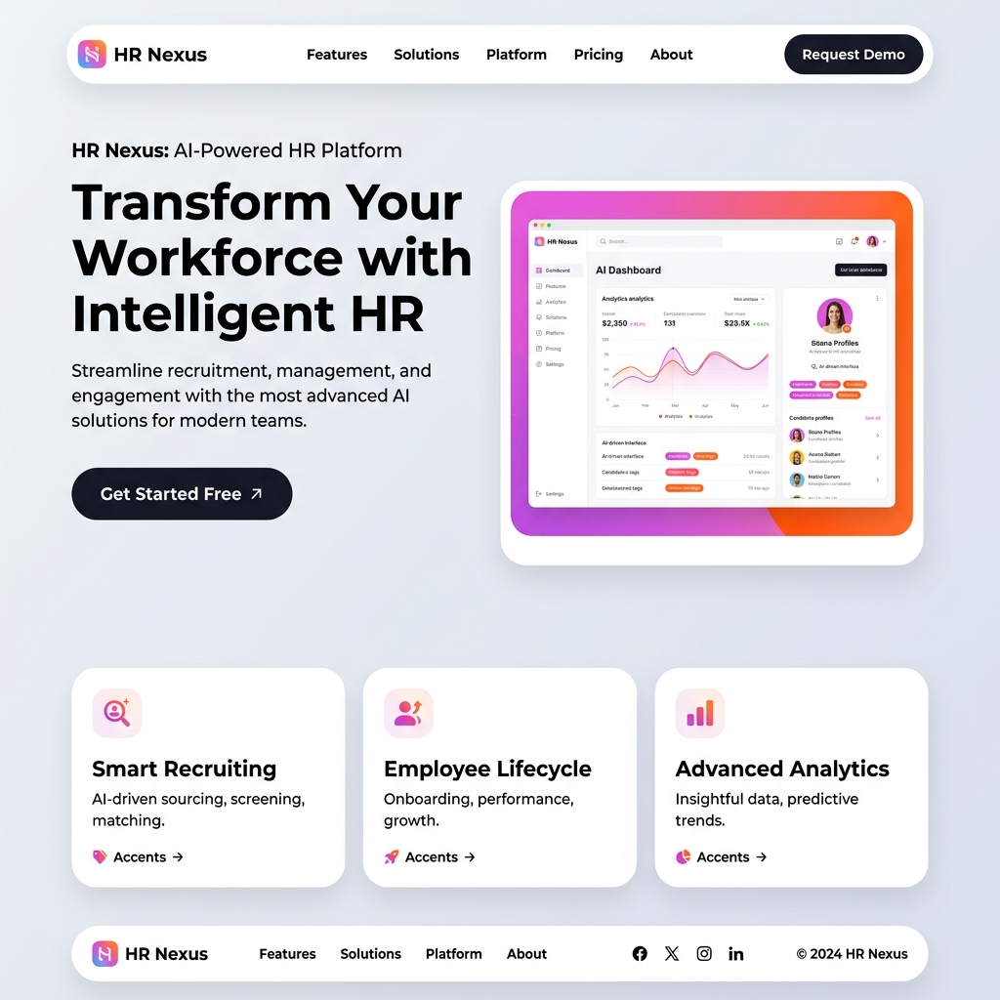
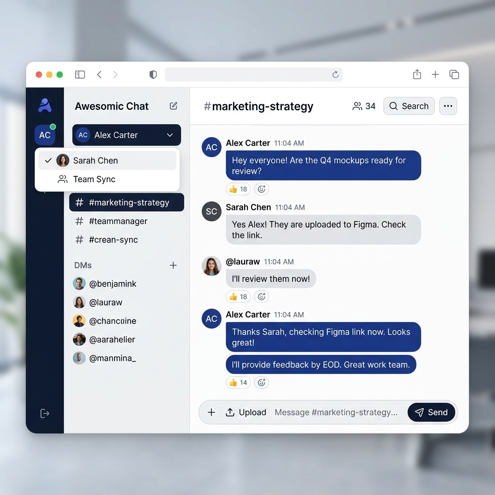

<div align="center">
  

  # HR Nexus
  **Turn HR Workflows Into Simple Conversations.**  
  *Built with ❤️ by **LARD TEAM** for the 2026 Hackathon (Productivity Enhancement Track)*

  [🚀 Launch Workspace](#getting-started) • [📖 Features](#key-features) • [🛠️ Tech Stack](#tech-stack)
</div>

---

## 🌟 About The Project

**HR Nexus** is an intelligent, chat-based HR workflow assistant designed to eliminate administrative friction. Instead of navigating complex HRMS portals and submitting endless forms, employees and managers can now execute entire HR workflows through natural language conversations. 

With its sleek **Awesomic-inspired design system**, HR Nexus delivers a premium UI/UX that proves enterprise software doesn't have to be boring.

## 📸 Screenshots

<div align="center">
  
  <p><em>The intuitive Chat Workspace featuring AI-driven contextual actions.</em></p>
</div>

---

## ✨ Key Features

### 1. Conversational Leave Management 🌴
- **Natural Language Requests:** "I want to take annual leave from next Monday to Wednesday for a family trip."
- **Smart Parsing:** Automatically extracts dates, leave types, and reasons.
- **One-Click Approvals:** Managers receive automated summary cards in the admin portal to approve or reject with a single click.

### 2. Intelligent Payroll Automation 💰
- **Excel-Driven Workflow:** Upload your raw `payroll.xlsx` directly into the chat.
- **Instant Validation:** The AI engine validates rows, checks for missing data, and calculates totals instantly.
- **Automated Artifacts:** Automatically generates bank-ready batch files (`.csv`) and processed result spreadsheets.

### 3. Recruitment Hub (CV AI Parsing) 🎯
- **Frictionless Applications:** Candidates upload their CVs directly to the portal via chat.
- **AI Scoring Engine:** The system instantly parses the document, matches it against job requirements, and provides a match score.

---

## 🎨 Design System (Awesomic Style)

This project strictly adheres to a modern **"Awesomic"** token system, engineered to provide a soft, welcoming, yet deeply professional enterprise interface.
- **Radii:** Dramatic `36px` rounded corners (`rounded-[36px]`).
- **Surfaces:** Clean `Mist` backgrounds with crisp `Snow` elevated cards.
- **Accents:** High-contrast `Obsidian` buttons accompanied by vibrant `Orchid Flash` and `Ember` gradients.
- **Shadows:** Multi-layered, subtle inner and drop shadows for realistic 3D depth (`shadow-subtle`).

---

## 💻 Tech Stack

- **Framework:** [Next.js 16 (App Router)](https://nextjs.org/)
- **Language:** [TypeScript](https://www.typescriptlang.org/)
- **Styling:** [Tailwind CSS v4](https://tailwindcss.com/)
- **Database ORM:** [Prisma](https://www.prisma.io/)
- **Icons:** [Lucide React](https://lucide.dev/)

---

## 🚀 Getting Started

To run HR Nexus locally and experience the magic yourself:

### Prerequisites
- Node.js (v18+ recommended)
- npm or yarn

### Installation

1. **Clone the repository**:
   ```bash
   git clone https://github.com/your-org/hr-nexus.git
   cd hr-nexus
   ```

2. **Navigate to the frontend app:**
   ```bash
   cd hr-nexus
   ```

3. **Install dependencies:**
   ```bash
   npm install
   ```

4. **Database Setup:**
   Generate the Prisma client based on the SQLite schema:
   ```bash
   npx prisma generate
   ```

5. **Start the development server:**
   ```bash
   npm run dev
   ```

6. **Open the app:**
   Navigate to `http://localhost:3000` to view the stunning Landing Page, then click **Launch Workspace** to start chatting.

---

## 🏆 The Team
Proudly engineered and designed by **LARD TEAM**.
- We believe in pushing the boundaries of productivity.
- We believe enterprise software should be beautiful.

*"Future of Work, Automated Today."*
